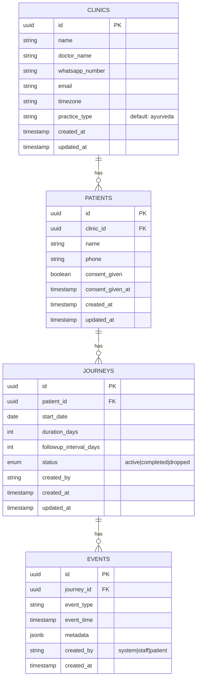

## Enhancement Summary

**Deepened on:** 2026-03-02
**Agents used:** 12 (9 reviewers + 3 researchers)

### Key Architectural Change: Hybrid Event Pattern (Not Full Event Sourcing)

Multiple reviewers independently concluded that full event sourcing is over-engineered for V1. The consensus recommendation:

- **Journey model stores computed state** (`riskLevel`, `lastVisitDate`, `nextVisitDate`, `missedVisits`) for fast dashboard reads
- **Events table remains as append-only activity log** for timeline display, audit trail, and future analytics
- **Cron writes risk results to Journey model**; dashboard reads a single indexed column
- **Result:** `SELECT risk_level FROM journeys WHERE clinic_id = ?` instead of replaying event streams. ~35-40% less code to build.

### Top 10 Improvements from Deepening

1. **Hybrid event pattern** — status fields on Journey + append-only events log (architecture, simplicity, research agents agree)
2. **Denormalize `clinicId` onto Journey** — eliminates 3-table join for every dashboard query (performance, pattern, security agents agree)
3. **Prisma enums** for `JourneyStatus`, `EventType`, `RiskLevel` — database-level constraints, not just TypeScript (TypeScript review)
4. **Type-safe discriminated union** for event metadata — Zod validation at creation boundary (TypeScript review)
5. **OTP rate limiting** — max 5 attempts per token + IP throttling via Upstash (security review)
6. **Gupshup webhook signature validation** — HMAC-SHA256 + replay protection (security review)
7. **DLT registration mandatory** for WhatsApp messaging in India — new prerequisite (Gupshup research)
8. **Cross-region latency** Railway US → Neon Mumbai = 150-250ms — mandate StaleWhileRevalidate caching (performance, deployment reviews)
9. **Cascade deletes + idempotency constraint** on events table (data integrity review)
10. **Skip swipe gestures and CSS slide transitions for V1** — standard taps and page navigation (simplicity, frontend races reviews)

### New Risks Discovered

- **DLT registration** (TRAI) requires PAN, GST, incorporation certificate — potential 1-2 week blocker
- **Cross-region latency** makes 3-second dashboard target hard without caching
- **Neon + Railway double cold start** — both can be cold simultaneously, adding 2-5s on first request

### Detailed Review Files

- [TypeScript Review](docs/reviews/2026-03-02-kieran-typescript-review-v1-plan.md)
- [Performance Review](docs/plans/2026-03-02-performance-review-ruthva-v1.md)
- [Security Audit](docs/security-audit-2026-03-02.md)
- [Architecture Review](docs/reviews/2026-03-02-architecture-review.md)
- [Simplicity Review](docs/plans/2026-03-02-simplicity-review-v1-plan.md)
- [Data Integrity Review](docs/reviews/2026-03-02-data-integrity-review.md)
- [Deployment Checklist](docs/plans/2026-03-02-deployment-checklist-railway-neon.md)
- [Frontend Races Review](docs/plans/2026-03-02-julik-race-condition-review.md)
- [Pattern Consistency Review](docs/plans/2026-03-02-pattern-consistency-review.md)
- [Gupshup API Best Practices](docs/13-gupshup-whatsapp-api-best-practices.md)
- [PWA Mobile Best Practices](docs/pwa-mobile-native-best-practices.md)
- [Best Practices Research](docs/best-practices-research.md)

---

# Ruthva V1 — Treatment Continuity Platform for Ayurveda Practices

## Overview

Ruthva is a WhatsApp-first Treatment Continuity Platform that detects patients dropping off Ayurveda treatments and brings them back automatically. V1 solves exactly one problem: **"Detect disappearing patients and bring them back."**

The product targets young Ayurveda clinics (1-3 doctors, Segment B) at ₹1,999/month. The core loop is: patient added → system monitors behaviour via daily WhatsApp check-ins → risk detected → recovery message sent → patient returns → doctor sees result on dashboard.

V1 ships in 6 weeks. No EMR, no billing, no prescriptions, no AI chatbots.

**Positioning:** Treatment Continuity Platform for Ayurveda Practices
**Market scope:** Ayurveda-branded, AYUSH-architected (see brainstorm: docs/04-whatsapp-protocol-wedge.md)

## Problem Statement

AYUSH treatments are inherently long-cycle protocols (30-90 days). Unlike allopathy where you get a prescription and leave, Ayurveda *requires* patient continuity to work — and to generate revenue (see brainstorm: docs/05-dropoff-recovery-wedge.md).

**The brutal math:** A clinic sees 30 patients/day with 60-day average treatment cycles. If 40% drop off after visit 2-3, the doctor loses lakhs per month in incomplete treatment revenue. They *know* patients disappear — they have no system to see it, track it, or act on it.

**Why this is sharper than clinic management:** "Clinic management software" is a category — vague and commodity. "You're losing ₹2-3 lakh/month because 4 out of 10 patients vanish mid-treatment" — that's a knife in the wound.

**Root cause:** Treatment success depends more on patient behaviour than doctor action. Modern medicine optimises diagnosis; AYUSH depends on compliance over time. Compliance is broken because protocols are complex, attention spans are short, follow-ups rely on memory, and doctors lose visibility after consultation (see brainstorm: docs/04-whatsapp-protocol-wedge.md).

## Proposed Solution

A minimal system that completes one loop:

```
Patient added
    ↓
System monitors via WhatsApp check-ins
    ↓
Risk detected (missed visits + silence)
    ↓
Recovery message sent automatically
    ↓
Patient returns
    ↓
Doctor sees result on dashboard
```

**The magic moment** (design around this): Doctor opens dashboard and sees:

```
⚠️ 11 patients likely to drop treatment this week
₹86,000 revenue at risk
[Recover Now]
```

**What Ruthva is NOT in V1:** practice management, EMR, prescription builder, protocol engine, AI diagnosis, analytics dashboards, billing system (see brainstorm: docs/09-v1-scope.md — "Hard DO NOT BUILD list").

## Technical Approach

### Architecture

```
┌──────────────────────────────────────────────────────┐
│                    RAILWAY                            │
│  ┌─────────────────────┐  ┌────────────────────────┐ │
│  │  Next.js 15 App     │  │  Cron Worker Service   │ │
│  │  (App Router + PWA) │  │  (Risk scoring,        │ │
│  │                     │  │   visit generation,    │ │
│  │  - Dashboard        │  │   adherence scheduling)│ │
│  │  - API Routes       │  │                        │ │
│  │  - Webhooks         │  │                        │ │
│  │  - Auth (Auth.js)   │  │                        │ │
│  └────────┬────────────┘  └───────────┬────────────┘ │
│           │                           │               │
│           └───────────┬───────────────┘               │
│                       │                               │
└───────────────────────┼───────────────────────────────┘
                        │
          ┌─────────────┼──────────────┐
          │             │              │
          ▼             ▼              ▼
┌──────────────┐ ┌────────────┐ ┌────────────────┐
│ Neon Postgres│ │  Gupshup   │ │  Resend        │
│ (Mumbai)     │ │  WhatsApp  │ │  (Email        │
│              │ │  API       │ │   fallback)    │
│ 4 app tables │ │            │ │                │
│ + auth tables│ │ Webhooks   │ │                │
└──────────────┘ └────────────┘ └────────────────┘
```

**Key architectural decisions:**
- **Neon Postgres Mumbai** instead of Railway Postgres — Railway has no India region; DPDP Act requires data localization for patient health data (see research: docs/10-tech-stack-best-practices.md)
- **Cross-region latency mitigation** — Railway US → Neon Mumbai = 150-250ms per query. Dashboard must use **StaleWhileRevalidate** via Serwist service worker: show cached data instantly, refresh in background. Cron worker latency is acceptable (batch job, not user-facing). Add `connect_timeout=15` to Neon connection strings for cold start handling.
- **Separate cron worker** on Railway for nightly risk scoring and visit generation — keeps web service responsive
- **Serwist** for PWA (next-pwa deprecated) — installable on clinic tablets
- **Auth.js v5** with 6-digit email OTP (sent via Resend) — simple, no WhatsApp dependency for auth, keeps Gupshup usage scoped to patient messaging only
- **Tailwind CSS v4** — utility-first styling with CSS variables for brand tokens; no component library dependency
- **Hybrid event pattern** — Journey model stores computed state (risk level, visit dates) for fast reads; events table is append-only activity log for timeline display and future analytics. NOT full event sourcing — status fields are the source of truth for current state, events are the audit trail.

### Database Schema

#### Entity Relationship Diagram



Plus Auth.js required tables: `users`, `accounts`, `sessions`, `verification_tokens` (via PrismaAdapter).

**Total: 8 tables** (4 app + 4 auth).

#### Prisma Schema (Core Tables — Post-Deepening)

```prisma
// schema.prisma

// Enums for database-level constraints (TypeScript review C2, C3)
enum JourneyStatus {
  active
  completed
  dropped
}

enum RiskLevel {
  stable
  watch
  at_risk
  critical
}

enum EventType {
  journey_started
  visit_expected
  visit_confirmed
  visit_missed
  adherence_check_sent
  adherence_response
  reminder_sent
  recovery_message_sent
  patient_returned
}

model Clinic {
  id             String    @id @default(cuid())
  name           String
  doctorName     String
  whatsappNumber String    @unique
  email          String?
  patients       Patient[]
  journeys       Journey[] // denormalized relation
  userId         String    @unique
  user           User      @relation(fields: [userId], references: [id])
  createdAt      DateTime  @default(now())
  updatedAt      DateTime  @updatedAt
}

model Patient {
  id             String    @id @default(cuid())
  clinicId       String
  clinic         Clinic    @relation(fields: [clinicId], references: [id], onDelete: Cascade)
  name           String
  phone          String    // encrypted at rest (security C1)
  phoneHash      String    // SHA-256 hash for lookups
  consentGiven   Boolean   @default(false)
  consentGivenAt DateTime?
  journeys       Journey[]
  createdAt      DateTime  @default(now())
  updatedAt      DateTime  @updatedAt

  @@unique([clinicId, phoneHash])
}

model Journey {
  id                   String        @id @default(cuid())
  patientId            String
  patient              Patient       @relation(fields: [patientId], references: [id], onDelete: Cascade)
  clinicId             String        // denormalized (performance + pattern reviews)
  clinic               Clinic        @relation(fields: [clinicId], references: [id])
  startDate            DateTime      @db.Date
  durationDays         Int
  followupIntervalDays Int
  status               JourneyStatus @default(active)

  // Computed state — written by cron, read by dashboard (hybrid pattern)
  riskLevel            RiskLevel     @default(stable)
  riskReason           String?
  riskUpdatedAt        DateTime?
  lastVisitDate        DateTime?     @db.Date
  nextVisitDate        DateTime?     @db.Date
  missedVisits         Int           @default(0)
  recoveryAttempts     Int           @default(0)
  lastActivityAt       DateTime?

  events               Event[]
  createdAt            DateTime      @default(now())
  updatedAt            DateTime      @updatedAt

  @@index([clinicId, status])
  @@index([clinicId, riskLevel])
  @@index([status, nextVisitDate]) // cron query: active journeys needing action
}

model Event {
  id        String    @id @default(cuid())
  journeyId String
  journey   Journey   @relation(fields: [journeyId], references: [id], onDelete: Cascade)
  eventType EventType
  eventDate DateTime  @db.Date  // for idempotency constraint
  eventTime DateTime
  metadata  Json      @default("{}")
  createdBy String    // system|staff|patient
  createdAt DateTime  @default(now())

  @@unique([journeyId, eventType, eventDate]) // idempotency (data integrity review)
  @@index([journeyId, eventTime])
  @@index([eventType, eventTime])
}
```

**Key schema changes from deepening:**
- **Prisma enums** (`JourneyStatus`, `RiskLevel`, `EventType`) — database rejects invalid values, TypeScript gets exhaustive switch checking (TypeScript review)
- **Denormalized `clinicId` on Journey** — eliminates 3-table join for dashboard queries (performance + pattern reviews)
- **Computed state on Journey** (`riskLevel`, `missedVisits`, `lastVisitDate`, etc.) — cron writes, dashboard reads one indexed column (architecture + simplicity reviews)
- **`onDelete: Cascade`** on all foreign keys — DPDP deletion works correctly (data integrity review)
- **Idempotency constraint** `@@unique([journeyId, eventType, eventDate])` — prevents duplicate events from cron reruns (data integrity + architecture reviews)
- **`phoneHash`** for lookups, `phone` encrypted at rest — DPDP compliance (security review)
- **`eventDate`** column — enables idempotency key and simplifies temporal queries

### Event Engine (Hybrid Pattern — 9 Event Types)

Events are an **append-only activity log**, not the source of truth for current state. Journey model fields (`riskLevel`, `status`, `missedVisits`) are the source of truth. Events power: patient timeline display, audit trail, and future analytics.

(see brainstorm: docs/09-v1-scope.md)

| Event Type | Origin | Trigger | Metadata |
|---|---|---|---|
| `journey_started` | staff | Patient + journey created | `{ duration: 30, interval: 7 }` |
| `visit_expected` | system | Generated from journey schedule | `{ visit_number: 3, expected_date: "2026-03-15" }` |
| `visit_confirmed` | staff/patient | Staff taps "Visited" or patient confirms via WhatsApp | `{ confirmed_by: "staff" }` |
| `visit_missed` | system | Nightly cron: expected_date + grace_days passed, no confirmation | `{ days_overdue: 3 }` |
| `adherence_check_sent` | system | Daily/adaptive cadence scheduler | `{ message_id: "gupshup_xyz" }` |
| `adherence_response` | patient | Patient replies to adherence check | `{ response: "yes"|"missed"|"help_needed" }` |
| `reminder_sent` | system | 1 day before visit_expected | `{ message_id: "gupshup_xyz" }` |
| `recovery_message_sent` | system | Patient at risk, triggered by risk engine | `{ attempt: 1, message_id: "gupshup_xyz" }` |
| `patient_returned` | staff | Staff confirms patient returned after being at-risk | `{ days_absent: 12 }` |

**Journey lifecycle rules** (addressing SpecFlow gap #1):
- Journey auto-completes when `today >= start_date + duration_days` AND status is `active` → cron sets `status = completed`, stops all messaging
- Journey marked `dropped` when `riskLevel = critical` for 14+ consecutive days → cron sets `status = dropped`, stops messaging
- **Risk downward transitions** (pattern review gap #3): when `patient_returned` event fires, cron resets `riskLevel = stable` and `missedVisits = 0` on next nightly run. Risk only changes at cron time, never in real-time.
- **One active journey per patient** — enforced by application logic (check before creating). Prevents duplicate messaging.
- **Cron race condition** resolved by hybrid pattern: cron reads `lastVisitDate` on Journey model (set by staff tap), not by scanning events. No TOCTOU race.

### WhatsApp Automation (3 Message Types)

(see brainstorm: docs/07-adherence-reminders-whatsapp.md)

All messages sent via Gupshup WhatsApp Business API using **Subscription API** (Callback URL API deprecated April 2025).

#### Message 1: Daily Adherence Check (Sensor)

```
Vanakkam 🙏

Just a quick check from {{clinic_name}}.

Were you able to continue your treatment today?

[✅ Yes]  [⚠️ Missed today]  [❓ Need help]
```

**Cadence rules:**
- Days 1-21: daily
- Days 22+: every 2 days
- Never send if a pre-visit reminder was sent same day

**Template category:** UTILITY (free within 24hr conversation window per Gupshup July 2025 pricing)

#### Message 2: Pre-Visit Reminder (Assist)

```
Vanakkam 🙏

This is a gentle reminder from {{clinic_name}}.

Your follow-up visit is expected tomorrow to keep treatment progress steady.

Would you like help confirming a time?

[✅ Yes]  [⏰ Later]
```

**Trigger:** 1 day before `visit_expected` date. Only for active journeys.

#### Message 3: Recovery Message (Intervention)

```
Vanakkam 🙏

Doctor asked us to check in.

We noticed you may have missed a follow-up. Continuing regularly usually gives better results.

Shall we help you schedule your next visit?

[✅ Yes]  [📞 Call me]
```

**Trigger:** Risk engine marks patient At Risk or Critical.

**Escalation policy** (addressing SpecFlow gap #2):
- 1st recovery message: 3 days after missed visit
- 2nd recovery message: 6 days after missed visit (different template, warmer tone)
- After 2nd message ignored: mark Critical, notify doctor via dashboard only — no more patient messages
- Max 2 recovery messages per missed-visit cycle

#### Webhook Handler

Gupshup sends both incoming messages and delivery status to a single webhook URL.

```
POST /api/webhooks/gupshup

1. Validate HMAC-SHA256 signature (security review C3)
2. Deduplicate by messageId (prevent replay attacks)
3. Respond 200 immediately (must return within 10 seconds)
4. Process async:
   Incoming message → parse quick reply → create event
   Status callback → log delivery status as event metadata
```

**Security hardening** (security review):
- HMAC-SHA256 signature validation using Gupshup app secret
- Timing-safe comparison (`crypto.timingSafeEqual`)
- Reject requests older than 5 minutes (replay protection)
- Validate payload shape with Zod before processing

**Response routing** (pattern review): Add `source_message_type` to `adherence_response` metadata to distinguish which message type the reply came from (adherence check vs reminder vs recovery). Uses `context.gsId` from Gupshup payload to link reply to original message.

**WhatsApp failure handling** (addressing SpecFlow gap):
- **Error 470** (24hr window expired) → resend as template message
- **Error 471** (rate limited/spam) → exponential backoff, check quality rating
- **Error 1002** (not on WhatsApp) → flag patient, no retry
- **Error 1008** (not opted in) → do not retry
- Patient blocks number → pause messaging for journey, flag on dashboard
- No silent failures — every send attempt logged as event

### Risk Engine (Deterministic Scoring)

(see brainstorm: docs/09-v1-scope.md)

Four risk levels with explainable reasons:

| Level | Criteria | Dashboard Display |
|---|---|---|
| **Stable** | All expected visits confirmed, recent adherence responses | Green |
| **Watch** | 1 adherence check ignored OR 1 day past expected visit | Yellow |
| **At Risk** | Visit overdue 3+ days OR 3+ consecutive adherence checks ignored | Orange |
| **Critical** | Visit overdue 7+ days OR no response for 7+ days after recovery message | Red |

**Scoring runs nightly** via cron worker. Writes results to `journey.riskLevel`, `journey.riskReason`, `journey.riskUpdatedAt`. Dashboard reads these fields directly — no event replay needed.

**Dashboard query** (hybrid pattern benefit):
```sql
SELECT * FROM journeys
WHERE clinic_id = ? AND status = 'active' AND risk_level IN ('at_risk', 'critical')
ORDER BY risk_level DESC, risk_updated_at ASC
```

Single indexed query. Sub-10ms even with cross-region latency.

**Doctor sees reasons:**
```
⚠️ At Risk — Follow-up overdue by 5 days, no recent responses
```

### Authentication

**6-digit OTP sent to email** via Resend + Auth.js v5.

Flow:
1. Doctor enters email address
2. System generates 6-digit code, sends via Resend (branded email from Ruthva)
3. Doctor enters 6-digit code on verification screen
4. Session created, persists on device
5. Clinic profile created on first login

**Why email OTP (not WhatsApp OTP or magic link):**
- Keeps Gupshup usage scoped to patient messaging only — no auth dependency on WhatsApp API
- 6-digit code is simpler UX than clicking a magic link (especially on mobile where email apps may not be default)
- No SMS costs or carrier delivery issues
- Doctors have email for professional communication (registration, conferences, etc.)

**Auth.js v5 implementation:**
- Resend provider with custom `generateVerificationToken()` returning `randomInt(100000, 999999).toString()`
- Custom `sendVerificationRequest` sends OTP in email body (not a magic link URL)
- Code expires in 10 minutes (`maxAge: 600`)
- Database session strategy (not JWT) — sessions persist across device restarts
- PrismaAdapter for session/token storage

**Security hardening** (security review):
- **OTP rate limiting:** max 5 verification attempts per token. After 5 failures, token invalidated, user must request new OTP. Implement with `@upstash/ratelimit` or in-memory counter.
- **IP-based throttling:** max 10 OTP requests per IP per hour
- **"Resend code" cooldown:** 60 seconds between resend requests

**Staff access** (addressing SpecFlow gap #3):
- V1: Single clinic account. Doctor logs in, shares device with staff. This matches how small Indian clinics actually operate (shared tablet/phone at front desk).
- The logged-in session persists on the PWA-installed device.
- Multi-user/roles deferred to V2.

### DPDP Act Compliance

(addressing SpecFlow gap #4 and research: docs/10-tech-stack-best-practices.md)

**Ruthva is a Data Fiduciary** under India's Digital Personal Data Protection Act 2023. Requirements for V1:

1. **Consent at patient creation:** Before saving patient data, staff must check a consent box: "Patient has given verbal consent for treatment monitoring via WhatsApp." Stores `consent_given: true` and `consent_given_at` timestamp. WhatsApp messages only sent if consent is true.

2. **Data stored in India:** PostgreSQL hosted on Neon Mumbai region (not Railway, which has no India region).

3. **Deletion capability:** API endpoint to delete all patient data + events on request. Not a UI feature in V1, but backend must support it.

4. **No medical information in WhatsApp messages:** Templates carefully worded to avoid specific medical/diagnosis content. "Continue your treatment" — not "take your Kashayam."
5. **Security headers** (security review H5): Add via `next.config.ts` headers — CSP, HSTS, X-Frame-Options, X-Content-Type-Options, Referrer-Policy.
6. **Clinic-scoped Prisma wrapper** (security review C4): `scopedPrisma(clinicId)` middleware that automatically filters every query — prevents cross-tenant data leaks by design, not developer discipline.

### PWA Configuration

- **Serwist** (successor to deprecated next-pwa) with Next.js 15
- Offline fallback page showing "You're offline — dashboard will sync when connected"
- App manifest for installability on clinic tablets/phones
- No push notifications in V1 (WhatsApp is the notification channel)

### Design System & UI

#### Principles

1. **Mobile-native feel** — This is a mobile app that happens to be built as a PWA. Every interaction must feel like tapping through a native app, not browsing a website. No horizontal scrolling on text. No tiny links. No desktop patterns scaled down.
2. **Lightweight** — No component library (no shadcn, no MUI). Raw Tailwind + Lucide React icons. Ship small, load fast on Indian 4G.
3. **Scalable brand system** — CSS custom properties for all design tokens. Brand changes propagate everywhere without hunting through files.
4. **Information density** — Clinic staff glance at the screen between patients. The dashboard must communicate risk in under 2 seconds.
5. **Touch-first** — Primary device is an Android phone (staff personal phone or shared clinic phone). Tablet secondary. Desktop barely considered.

#### Brand Tokens (Tailwind CSS Variables)

```css
/* app/globals.css */
@import "tailwindcss";

@theme {
  /* Brand palette — warm, trustworthy, clinical-but-approachable */
  --color-brand-50: #f0fdf4;
  --color-brand-100: #dcfce7;
  --color-brand-500: #22c55e;
  --color-brand-600: #16a34a;
  --color-brand-700: #15803d;
  --color-brand-900: #14532d;

  /* Risk levels — semantic, instantly scannable */
  --color-risk-stable: #22c55e;    /* green-500 */
  --color-risk-watch: #eab308;     /* yellow-500 */
  --color-risk-at-risk: #f97316;   /* orange-500 */
  --color-risk-critical: #ef4444;  /* red-500 */

  /* Neutral scale */
  --color-surface: #ffffff;
  --color-surface-raised: #f9fafb;
  --color-surface-sunken: #f3f4f6;
  --color-border: #e5e7eb;
  --color-border-strong: #d1d5db;
  --color-text-primary: #111827;
  --color-text-secondary: #6b7280;
  --color-text-muted: #9ca3af;

  /* Typography scale */
  --font-sans: 'Inter', system-ui, sans-serif;
  --text-xs: 0.75rem;
  --text-sm: 0.875rem;
  --text-base: 1rem;
  --text-lg: 1.125rem;
  --text-xl: 1.25rem;
  --text-2xl: 1.5rem;
  --text-3xl: 1.875rem;

  /* Spacing scale (consistent rhythm) */
  --radius-sm: 0.375rem;
  --radius-md: 0.5rem;
  --radius-lg: 0.75rem;
  --radius-xl: 1rem;
}
```

#### Color Rationale

- **Green brand** — health, growth, continuity. Differentiates from the blue/purple of clinic management tools. Ayurveda is associated with nature/healing.
- **Risk colors** — traffic-light mental model. No learning curve. Doctor instantly knows red = urgent.
- **Warm neutrals** — gray-50 through gray-900. Professional without feeling cold/corporate.

#### Typography

- **Inter** — clean, highly legible at small sizes on mobile, excellent number rendering (important for stats dashboard). Free, widely cached.
- Body: 14px (`text-sm`), Secondary: 12px (`text-xs`), Headings: 18-24px (`text-lg` to `text-2xl`)
- Numbers on dashboard: `tabular-nums` for alignment

#### Component Patterns (No Library — Just Conventions)

V1 uses a small set of repeating patterns. No abstraction library needed — just Tailwind classes applied consistently.

**Stat Card** (dashboard):
```
┌─────────────────────┐
│  ⚠️ 11              │  ← large number, risk-colored
│  Patients at risk    │  ← text-secondary label
│  ₹86,000 at risk    │  ← text-muted subtext
└─────────────────────┘
```

```tsx
// Consistent pattern, not a component library
<div className="rounded-lg border border-border bg-surface p-4">
  <p className="text-3xl font-semibold tabular-nums text-risk-critical">11</p>
  <p className="text-sm text-text-secondary">Patients at risk</p>
  <p className="text-xs text-text-muted">₹86,000 at risk</p>
</div>
```

**Patient Row** (at-risk list):
```
┌──────────────────────────────────────────────────┐
│ 🔴 Ravi Kumar    Last visit: 12 days ago   [→]  │
│    Follow-up overdue                              │
└──────────────────────────────────────────────────┘
```

**Action Button** (primary):
```tsx
<button className="rounded-md bg-brand-600 px-4 py-2 text-sm font-medium text-white hover:bg-brand-700 active:bg-brand-800 transition-colors">
  Recover Now
</button>
```

**Risk Badge:**
```tsx
<span className="inline-flex items-center rounded-full px-2 py-0.5 text-xs font-medium bg-risk-critical/10 text-risk-critical">
  Critical
</span>
```

#### Mobile-Native Interaction Patterns

**Touch targets:** Every tappable element is minimum 44x44px. No small links, no inline text buttons. All actions are full-width buttons or large tap areas.

**Gestures (V1 — keep simple per simplicity + frontend races reviews):**
- Pull-to-refresh on dashboard (native-feeling data refresh) — use `overscroll-behavior-y: contain`
- Tap patient row → navigate to patient timeline (standard page navigation, no slide transitions in V1)
- Bottom sheet for confirmations (not modal dialogs — modals feel web-like)
- ~~Swipe-right on patient row~~ **Deferred to V2** — swipe competes with scroll and pull-to-refresh, complex gesture discrimination needed (frontend races review)

**Navigation:** Bottom tab bar, not top navigation. Feels like WhatsApp/PhonePe — apps Indian users already know.

**Viewport:** Use `100dvh` (dynamic viewport height) — handles mobile browser chrome correctly. No content hidden behind address bars.

**Safe areas:** `env(safe-area-inset-bottom)` padding on bottom tab bar and FAB — handles phones with gesture navigation bars.

**No 300ms tap delay:** PWA with `<meta name="viewport" content="width=device-width">` eliminates this automatically.

**Double-tap prevention** (frontend races review): Every mutation button uses a `useRef`-based guard, not `useState` (React batches state updates, so two taps in one frame both read old state). Pattern: `IDLE → PENDING → CONFIRMED/FAILED`. Disable button on first tap.

**Optimistic updates:** "Mark Visited" tap shows immediate visual feedback (green check), then confirms server-side. On failure, revert with inline error message. Use `useRef` for synchronous guard.

**Form submission:** Patient creation form disables submit button on first tap. `@@unique([clinicId, phoneHash])` catches duplicates at DB level; return friendly "Patient already exists" message.

**Page transitions:** Use **View Transitions API** (production-ready on Android Chrome 111+). Next.js has experimental `viewTransition: true` flag. CSS-only crossfade (200ms) — zero library overhead, GPU-composited. ~~Slide transitions~~ deferred to V2 (frontend races review: React unmounts old page, nothing to animate from).

#### Layout Structure

```
┌──────────────────┐
│  Ruthva  🏥 [👤] │  ← compact header (clinic name, 48px height)
├──────────────────┤
│                  │
│  ┌────────────┐  │
│  │ ⚠️ 11      │  │  ← stat cards, stacked vertically
│  │ At Risk    │  │     (not horizontal scroll — too fiddly on phone)
│  │ ₹86K risk  │  │
│  └────────────┘  │
│  ┌────┐  ┌────┐  │  ← secondary stats in 2-col grid
│  │ 14 │  │₹1.2L│ │
│  │Recov│  │Saved│ │
│  └────┘  └────┘  │
│                  │
│ ── At Risk ───── │  ← section divider
│                  │
│ ┌──────────────┐ │
│ │🔴 Ravi Kumar │ │  ← full-width patient cards
│ │   5 days over│ │     large tap target (entire card)
│ │   [Recover →]│ │     min-height: 72px
│ ├──────────────┤ │
│ │🟠 Priya S.   │ │
│ │   2 days over│ │
│ │   [Remind →] │ │
│ └──────────────┘ │
│                  │
│                  │  ← scroll area (bottom-padded for tab bar)
│                  │
├──────────────────┤
│ 🏠  👥   ➕  ⚙️  │  ← bottom tab bar (fixed, 56px + safe area)
│Home Patients Add Set│   ➕ is the primary action (larger, brand-colored)
└──────────────────┘
```

**Bottom tab bar** (4 tabs):
| Tab | Icon | Screen | Priority |
|---|---|---|---|
| Home | `Home` | Dashboard with stats + at-risk list | Default |
| Patients | `Users` | All patients list (searchable) | Secondary |
| Add | `PlusCircle` | Add patient form | Primary action (brand-colored) |
| Settings | `Settings` | Clinic profile, logout | Rare use |

**Why bottom tabs instead of FAB:**
- FAB is a single action; bottom tabs give persistent navigation
- Matches the mental model of "this is an app" — every Indian smartphone user knows bottom tabs from WhatsApp, PhonePe, Swiggy
- The Add tab is oversized/highlighted to draw attention as the primary action

**Patient card design** (feels like a chat list item):
```tsx
<div className="flex items-center gap-3 px-4 py-3 min-h-[72px] active:bg-surface-sunken transition-colors">
  <div className="h-10 w-10 rounded-full bg-risk-critical/10 flex items-center justify-center">
    <AlertCircle className="h-5 w-5 text-risk-critical" />
  </div>
  <div className="flex-1 min-w-0">
    <p className="text-sm font-medium text-text-primary truncate">Ravi Kumar</p>
    <p className="text-xs text-text-muted">Follow-up overdue by 5 days</p>
  </div>
  <ChevronRight className="h-5 w-5 text-text-muted flex-shrink-0" />
</div>
```

#### PWA Manifest (App-Like Install)

```ts
// app/manifest.ts
export default function manifest() {
  return {
    name: 'Ruthva',
    short_name: 'Ruthva',
    description: 'Treatment Continuity for Ayurveda',
    start_url: '/dashboard',
    display: 'standalone',           // ← no browser chrome, feels native
    orientation: 'portrait',         // ← lock to portrait
    background_color: '#ffffff',
    theme_color: '#16a34a',          // brand-600
    icons: [
      { src: '/icon-192.png', sizes: '192x192', type: 'image/png' },
      { src: '/icon-512.png', sizes: '512x512', type: 'image/png' },
    ],
  }
}
```

`display: standalone` removes the browser URL bar entirely. The app fills the screen like a native app. Combined with `theme_color`, the status bar matches the brand.

#### Add Patient Form (Mobile-Optimized)

The most frequent action. Must feel instant.

```
┌──────────────────┐
│  ← Add Patient   │  ← back arrow, simple header
├──────────────────┤
│                  │
│  Patient Name    │
│  ┌──────────────┐│
│  │ Ravi Kumar   ││  ← large input, 48px height, auto-focus
│  └──────────────┘│
│                  │
│  Phone Number    │
│  ┌──────────────┐│
│  │ +91 98765... ││  ← tel input type (numeric keyboard)
│  └──────────────┘│
│                  │
│  Treatment       │
│  ┌──┐┌──┐┌──┐┌──┐│
│  │15││30││45││60││  ← pill buttons (tap to select, not dropdown)
│  └──┘└──┘└──┘└──┘│  ← 30 days pre-selected
│                  │
│  Follow-up       │
│  ┌────┐ ┌──────┐ │
│  │Week│ │2 Weeks│ │  ← pill buttons, weekly pre-selected
│  └────┘ └──────┘ │
│                  │
│  ☑ Patient has   │
│    consented to  │  ← consent checkbox (DPDP)
│    WhatsApp      │
│    monitoring    │
│                  │
│ ┌──────────────┐ │
│ │  Add Patient │ │  ← full-width primary button, 48px height
│ └──────────────┘ │
│                  │
└──────────────────┘
```

- **Pill buttons** instead of dropdowns — one tap, not two. Removes the awkward mobile dropdown that covers half the screen.
- **`inputmode="tel"`** on phone field — opens numeric keyboard directly.
- **16px font-size minimum** on all inputs — prevents iOS zoom on focus (do NOT use `maximum-scale=1` in viewport).
- **Auto-focus** on patient name with 300ms delay after page transition — keyboard appears after animation completes.
- **Pre-selected defaults** (30 days, weekly) — most common values. Doctor taps override only when needed.

#### Icons

**Lucide React** — consistent, lightweight (tree-shakeable), clean aesthetic. Used for:
- Navigation: `Home`, `Users`, `Plus`, `ChevronRight`
- Risk indicators: `AlertTriangle`, `AlertCircle`, `CheckCircle`
- Actions: `MessageSquare`, `Phone`, `Clock`
- Status: `TrendingUp`, `TrendingDown`, `Activity`

#### What NOT to Build (Design Scope)

- No dark mode (clinic use is daytime)
- No theme switcher
- No complex page transition animations (CSS slide transitions only — no framer-motion)
- No skeleton loaders (simple loading spinner is fine for V1)
- No complex charts or graphs (stat cards with numbers only)
- No responsive desktop layout — mobile layout works on desktop too, just centered with max-width
- No hamburger menus (bottom tabs handle all navigation)
- No toast notifications (WhatsApp is the notification channel; in-app feedback via inline messages only)

### Implementation Phases

#### Phase 1: Foundation (Week 1-2)

**Goal:** Project scaffolding, database, auth, and basic patient CRUD.

**Tasks:**
- [x] Initialize Next.js 15 project with App Router + TypeScript
- [x] Install and configure Tailwind CSS v4 with brand tokens in `globals.css`
- [x] Install Lucide React icons
- [x] Add Inter font via `next/font/google`
- [x] Configure Serwist PWA (manifest, service worker, offline fallback)
- [x] Set up Prisma ORM with Neon Postgres (Mumbai) — pooled + direct URLs, `connect_timeout=15`
- [x] Create schema: 4 app tables (with enums, cascade deletes, idempotency constraints) + 4 Auth.js tables
- [x] Create Prisma global singleton (`lib/db.ts`) to prevent connection pool exhaustion
- [x] Create clinic-scoped Prisma wrapper (`lib/scoped-db.ts`)
- [ ] Run initial migration
- [x] Implement Auth.js v5 with 6-digit email OTP (Resend) — custom email provider, VerificationToken, 10-min expiry
- [x] Add OTP rate limiting (max 5 attempts per token, IP throttling)
- [x] Add security headers in `next.config.ts`
- [x] Build clinic onboarding: Step 1 (identity) + Step 2 (promise preview)
- [x] Build patient creation form (name, phone, duration, interval — under 20 seconds)
- [x] Add consent checkbox to patient creation
- [x] Create `journey_started` event on patient creation
- [x] Generate `visit_expected` events based on duration + interval

**Key files:**
```
app/
├── layout.tsx
├── page.tsx (landing/login)
├── manifest.ts
├── sw.ts (Serwist service worker)
├── (auth)/
│   ├── login/page.tsx
│   └── verify/page.tsx
├── (app)/
│   ├── layout.tsx (authenticated shell)
│   ├── onboarding/page.tsx
│   ├── dashboard/page.tsx
│   └── patients/
│       ├── page.tsx (list)
│       └── new/page.tsx (creation form)
├── api/
│   ├── auth/[...nextauth]/route.ts
│   └── webhooks/
│       └── gupshup/route.ts
prisma/
├── schema.prisma
lib/
├── auth.ts (Auth.js config)
├── db.ts (Prisma client)
├── events.ts (event creation helpers)
└── gupshup.ts (WhatsApp API client)
```

**Success criteria:** Doctor can sign up via WhatsApp OTP, create clinic, add a patient, and see journey created with expected visits.

---

#### Phase 2: Event Engine + Dashboard (Week 2-3)

**Goal:** Core event processing and the single-screen doctor dashboard.

**Tasks:**
- [ ] Build event creation service (type-safe helpers for all 9 event types)
- [ ] Build visit confirmation UI (staff one-tap "Visited" button on patient row)
- [ ] Create `visit_confirmed` event on tap
- [ ] Build doctor dashboard showing:
  - Patients at risk count
  - Critical patients count
  - Recovered this month count
  - Revenue protected estimate (remaining_days × avg_visit_value)
- [ ] Build at-risk patient list (name, risk level, last activity, action button)
- [ ] Build patient timeline view (event log)
- [ ] Implement `patient_returned` event (staff marks returned after at-risk)

**Key files:**
```
app/(app)/
├── dashboard/page.tsx (main dashboard)
├── patients/
│   └── [id]/page.tsx (patient timeline)
lib/
├── events.ts (event creation service)
├── risk.ts (risk level computation)
└── dashboard.ts (dashboard stat queries)
```

**Success criteria:** Dashboard shows accurate at-risk counts. Staff can confirm visits with one tap. Patient timeline shows full event history.

---

#### Phase 3: WhatsApp Automation (Week 3-4)

**Goal:** All three message types sending and receiving via Gupshup.

**Tasks:**
- [ ] Register Gupshup WhatsApp Business account
- [ ] Submit 3 message templates for Meta approval (adherence check, pre-visit reminder, recovery) — allow 24-48hr approval time
- [ ] Build Gupshup API client (send template message with quick-reply buttons)
- [ ] Build webhook handler at `/api/webhooks/gupshup`:
  - Parse incoming quick-reply responses → create `adherence_response` event
  - Parse delivery status callbacks → update event metadata
  - Handle error codes (470 = blocked, etc.)
- [ ] Build adherence check scheduler:
  - Days 1-21: daily
  - Days 22+: every 2 days
  - Skip if pre-visit reminder sent same day
  - Create `adherence_check_sent` event
- [ ] Build pre-visit reminder sender (1 day before `visit_expected`)
- [ ] Create `reminder_sent` event
- [ ] Implement retry logic (1 retry after 1 hour on delivery failure)
- [ ] Configure Gupshup Subscription API for webhook delivery

**Success criteria:** Patient receives daily WhatsApp check-in, can reply with buttons, response appears as event in patient timeline.

---

#### Phase 4: Risk Engine + Recovery (Week 4-5)

**Goal:** Automated risk detection and recovery message flow.

**Tasks:**
- [ ] Build nightly cron worker (separate Railway service):
  - Generate `visit_expected` events for upcoming visits
  - Detect missed visits (expected + 3 days, no confirmation) → emit `visit_missed`
  - Compute risk levels for all active journeys
  - Auto-complete journeys past duration date
  - Auto-drop journeys with 14+ days Critical + no response
- [ ] Implement risk scoring logic (Stable → Watch → At Risk → Critical)
- [ ] Build recovery message trigger:
  - At Risk → send 1st recovery message
  - Still At Risk after 3 more days → send 2nd recovery message
  - After 2nd ignored → Critical, notify doctor on dashboard only
- [ ] Create `recovery_message_sent` events with attempt number
- [ ] Add conflict resolution: if `visit_confirmed` exists for a date, ignore `visit_missed` for same date (latest event wins)
- [ ] Build message fatigue limiter (no more than 1 message per day per patient)

**Key files:**
```
cron/
├── index.ts (cron entry point)
├── generate-expected-visits.ts
├── detect-missed-visits.ts
├── compute-risk-levels.ts
├── trigger-recovery-messages.ts
└── complete-expired-journeys.ts
```

**Success criteria:** System automatically detects a patient who missed their visit, sends recovery message, and dashboard shows them as At Risk with reason.

---

#### Phase 5: Onboarding Polish + Deploy (Week 5-6)

**Goal:** Ship to first 2-3 friendly clinics.

**Tasks:**
- [ ] Build full 5-step onboarding flow (see brainstorm: docs/08-onboarding-pricing-gtm.md):
  1. Identity (clinic name, doctor name, email — 30 sec)
  2. Promise preview (pre-filled demo dashboard — 30 sec)
  3. Add first patient (90 sec)
  4. Message preview (show what patient will receive — 60 sec)
  5. Outcome simulation (fast-forward to show risk detection — 60 sec)
- [ ] Deploy Next.js app to Railway (standalone output mode)
- [ ] Deploy cron worker to Railway (separate service)
- [ ] Connect Neon Postgres Mumbai
- [ ] Configure environment variables (Gupshup API key, Resend API key, database URLs)
- [ ] Set up separate `DATABASE_URL` (pooled) and `DIRECT_URL` (migrations) for Prisma on Railway
- [ ] PWA testing on Android Chrome (primary clinic device)
- [ ] Onboard 2-3 friendly clinics
- [ ] Monitor first week: message delivery, patient responses, dashboard accuracy
- [ ] Bug fixes from real usage

**Success criteria:** A doctor at a real clinic says: "Yesterday your system reminded a patient and they came back."

## Alternative Approaches Considered

| Approach | Why Rejected |
|---|---|
| **Full EMR with reminders** | Too broad for V1; 6+ months to ship; competes in saturated market (see brainstorm: docs/01-competitive-analysis.md) |
| **Panchakarma centres as primary ICP** | Higher WTP but longer sales cycle, more complex workflows. Young clinics adopt faster, validate faster. Panchakarma is expansion ICP. (see brainstorm: docs/02-icp-segmentation.md) |
| **Patient-facing mobile app** | "Download patient app" = failure in India. WhatsApp-native aligns with existing behaviour (see brainstorm: docs/04-whatsapp-protocol-wedge.md) |
| **AI-first approach (NLP extraction, chatbot)** | AI adds fragility early. Rules beat intelligence in V1. Start with structured protocol representation. (see brainstorm: docs/04-whatsapp-protocol-wedge.md) |
| **Performance-based pricing** | Attribution disputes, accounting complexity, trust friction. Flat subscription builds trust first. (see brainstorm: docs/08-onboarding-pricing-gtm.md) |
| **WhatsApp OTP for auth** | Adds Gupshup dependency to login flow. Keeps auth and patient messaging concerns separate. Email OTP is simpler to implement and debug. |
| **Email magic link** | Clicking a link is clunkier on mobile than entering a 6-digit code. Link may open in wrong browser. OTP is more universally understood. |

## System-Wide Impact

### Interaction Graph

```
Patient Creation (staff)
  → journey_started event
  → visit_expected events generated (system)
  → adherence_check scheduled (cron)

Daily Cron Run
  → generates visit_expected for upcoming visits
  → detects visit_missed (no confirmation past grace period)
  → computes risk levels (queries events per journey)
  → triggers recovery_message_sent (if At Risk)
  → completes expired journeys (past duration)

Gupshup Webhook (incoming)
  → parses quick-reply or free text
  → creates adherence_response event
  → risk level recomputed on next cron run

Staff Visit Confirmation
  → creates visit_confirmed event
  → overrides any pending visit_missed for same date
```

### Error & Failure Propagation

| Failure | Impact | Mitigation |
|---|---|---|
| Gupshup API down | Messages not sent | Retry once after 1hr; log `message_failed` event; skip cycle |
| Patient blocks WhatsApp number | Error 470 from Gupshup | Pause messaging for journey; flag on dashboard |
| Nightly cron fails | No risk updates for a day | Railway health checks + manual trigger endpoint; idempotent job design |
| Neon Postgres connection timeout | App errors | Prisma connection pooling; Railway retry; offline PWA shows cached dashboard |
| Auth email delivery failure | Doctor can't log in | Resend has 99.5%+ delivery; show "Resend code" button with 60-sec cooldown; check spam folder prompt |

### State Lifecycle Risks

- **Partial journey creation:** If patient created but event generation fails → wrap in transaction; rollback patient if events fail
- **Duplicate events:** Cron runs overlapping → use idempotency key (journey_id + event_type + date) with unique constraint
- **Stale risk levels:** Risk computed nightly, not real-time → acceptable for V1; adherence_response events provide intra-day signal
- **Orphaned journeys:** Patient deleted but journey exists → cascade delete in Prisma schema

### API Surface Parity

V1 has a single interface: the PWA web app. No public API, no mobile app, no integrations. All interactions go through Next.js server actions and API routes.

### Integration Test Scenarios

1. **Full recovery loop:** Add patient → miss visit → cron detects → recovery message sent via Gupshup → patient replies "Yes" via webhook → event created → dashboard updated
2. **Concurrent visit confirmation:** Staff confirms visit at 11:58 PM, cron runs at midnight — verify visit_confirmed takes precedence over potential visit_missed
3. **Message fatigue:** Patient on day 25 of treatment — verify adherence check sent every 2 days, not daily
4. **Journey expiry:** Journey duration 30 days, today is day 31 — verify cron marks completed, all messaging stops
5. **Blocked number:** Gupshup returns 470 error — verify messaging pauses, dashboard flags the patient

## Acceptance Criteria

### Functional Requirements

- [ ] Doctor can sign up via 6-digit email OTP in under 60 seconds
- [ ] Staff can add a patient in under 20 seconds (name, phone, duration, interval)
- [ ] Consent checkbox required before patient data is saved
- [ ] System generates expected visit timeline automatically from duration + interval
- [ ] Daily adherence check sent via WhatsApp with 3 quick-reply buttons
- [ ] Pre-visit reminder sent 1 day before expected visit
- [ ] System detects missed visit after 3-day grace period
- [ ] Recovery message sent automatically when patient is At Risk
- [ ] Max 2 recovery messages per missed-visit cycle
- [ ] Staff can confirm visit with one tap
- [ ] Dashboard shows: patients at risk, recovered this month, revenue protected
- [ ] Patient timeline shows chronological event history
- [ ] Journey auto-completes when past duration date
- [ ] Journey auto-drops after 14 days Critical with no response
- [ ] Adherence check frequency reduces from daily to every-2-days after day 21
- [ ] No more than 1 WhatsApp message per patient per day

### Non-Functional Requirements

- [ ] PWA installable on Android Chrome
- [ ] Offline fallback page when no connectivity
- [ ] Dashboard loads in under 3 seconds on 4G connection
- [ ] Patient data stored in India (Neon Mumbai)
- [ ] WhatsApp message delivery retry on failure (1 retry, 1hr delay)
- [ ] Nightly cron completes in under 5 minutes for 100 active journeys
- [ ] Idempotent cron execution (safe to re-run)

### Quality Gates

- [ ] All API routes have input validation (Zod schemas)
- [ ] Webhook endpoint validates Gupshup signature
- [ ] No patient health information in WhatsApp message content
- [ ] Event creation helper is type-safe (TypeScript union for event types)
- [ ] Database queries scoped to clinic_id (no cross-tenant data leaks)
- [ ] Environment variables documented in `.env.example`

## Success Metrics

**Primary metric (the only one that matters in V1):**

```
Recovered patients per clinic per month
```

(see brainstorm: docs/09-v1-scope.md — "If this number increases, everything else becomes solvable.")

**Supporting metrics (track but don't optimize for):**
- Adherence check reply rate (baseline for message effectiveness)
- Average days-to-recovery after first recovery message
- Daily active clinics (are doctors checking the dashboard?)
- Patient journeys created per clinic per week (adoption depth)

**V1 target:** 5+ recovered patients per clinic per month within first 60 days of usage.

## Dependencies & Prerequisites

### External Dependencies

| Dependency | Lead Time | Risk |
|---|---|---|
| Gupshup WhatsApp Business account | 2-5 business days setup | Medium — requires business verification |
| Meta template approval (3 templates) | 24-48 hours per template | Low — utility templates usually approved |
| Neon Postgres Mumbai account | Immediate (self-service) | Low |
| Railway account + deployment | Immediate | Low |
| Resend account (email fallback) | Immediate | Low |
| Indian business entity (for Gupshup) | May require days if not established | High — blocker for WhatsApp Business API |
| TRAI DLT registration | 1-2 weeks (requires PAN, GST, incorporation cert) | High — mandatory for WhatsApp messaging in India (Gupshup research) |

### Prerequisites Before Code

1. Register Gupshup account and complete business verification
2. Draft and submit 3 WhatsApp message templates (start early — approval needed before Phase 3)
3. Set up Neon Postgres in Mumbai region
4. Create Railway project with web + cron services

## Risk Analysis & Mitigation

| Risk | Likelihood | Impact | Mitigation |
|---|---|---|---|
| WhatsApp template rejection by Meta | Medium | High (blocks messaging) | Submit templates early; use conservative/generic wording; have backup templates ready |
| Gupshup API reliability issues | Low | High | Log all failures; manual trigger endpoint for missed messages; consider Twilio as backup provider |
| Doctor adoption friction (too many steps) | Medium | High | 5-minute onboarding with simulation; under-20-second patient add; zero-config after setup |
| Patient message fatigue / blocking | High | Medium | Adaptive frequency (daily → every 2 days); warm clinic-voice tone; max 2 recovery attempts |
| DPDP Act enforcement action | Low (early stage) | Very High | Consent at patient creation; data in India; deletion endpoint ready; no medical content in messages |
| Railway downtime affects cron | Low | Medium | Idempotent cron design; manual trigger endpoint; health monitoring |
| Scope creep (adding EMR/billing features) | High | High | Hard "DO NOT BUILD" boundary (see brainstorm: docs/09-v1-scope.md); revisit only after PMF |

## Future Considerations (Post-V1)

The brainstorm documents outline a clear expansion path (see brainstorm: docs/04-whatsapp-protocol-wedge.md):

```
V1: Treatment Continuity (Drop-off Recovery)
    ↓
V2: Adherence Intelligence (scoring, prediction, optimal timing)
    ↓
V3: Protocol Execution Engine (treatment state machine)
    ↓
V4: AYUSH Intelligence Network (cross-clinic outcome learning)
```

**V2 candidates** (unlocked by V1 event data):
- Adherence scoring (computed from daily check-in patterns)
- Drop-off prediction (ML on event history)
- Multi-user roles (staff accounts)
- Patient-initiated rescheduling via WhatsApp
- Siddha expansion (first adjacent market)
- Google Review automation on positive milestones

**V3 candidates:**
- Protocol state machine (Detox → Medicine → Diet → Maintenance)
- Panchakarma therapy tracking (room scheduling, therapist allocation)
- Treatment outcome analytics

**Pricing evolution** (see brainstorm: docs/08-onboarding-pricing-gtm.md):
- Phase 1 (first 50 clinics): ₹1,999/month flat
- Phase 2 (after PMF): ₹3,999/month (300 journeys), ₹7,999/month (unlimited)

## Sources & References

### Origin

**Brainstorm documents (9 files):**
- [docs/01-competitive-analysis.md](docs/01-competitive-analysis.md) — Feature vs Pricing Gap Map; identified revenue/retention as biggest untapped opportunity
- [docs/02-icp-segmentation.md](docs/02-icp-segmentation.md) — ICP analysis; Segment B (young clinics) and C (Panchakarma centres) as primary targets
- [docs/03-data-portability-lockin.md](docs/03-data-portability-lockin.md) — Ethical lock-in through workflow depth, not data hostage
- [docs/04-whatsapp-protocol-wedge.md](docs/04-whatsapp-protocol-wedge.md) — WhatsApp-native Treatment Execution Engine concept; 4-phase moat path
- [docs/05-dropoff-recovery-wedge.md](docs/05-dropoff-recovery-wedge.md) — Patient drop-off recovery as entry wedge; Treatment Continuity Visibility
- [docs/06-v1-scope-event-schema.md](docs/06-v1-scope-event-schema.md) — Event-driven architecture; 4-table schema; 4-screen UI
- [docs/07-adherence-reminders-whatsapp.md](docs/07-adherence-reminders-whatsapp.md) — Reminders as sensors; message fatigue handling; WhatsApp conversation design
- [docs/08-onboarding-pricing-gtm.md](docs/08-onboarding-pricing-gtm.md) — 5-minute onboarding; ₹1,999 pricing; founder-led GTM
- [docs/09-v1-scope.md](docs/09-v1-scope.md) — Hard feature boundary; 6 modules; DO NOT BUILD list

**Key decisions carried forward from brainstorm + planning session:**
1. Ayurveda-branded, AYUSH-architected (market scope)
2. "Treatment Continuity Platform for Ayurveda Practices" (positioning)
3. Young clinics at ₹1,999/month (ICP + pricing)
4. 9 canonical events, journey_completed computed not stored (event schema)
5. clinics + patients + journeys + events (database schema)
6. Next.js 15 PWA + Tailwind v4 + PostgreSQL (Neon Mumbai) + Gupshup + Railway + Auth.js v5 (6-digit email OTP via Resend) (tech stack)

### Research

- [docs/10-tech-stack-best-practices.md](docs/10-tech-stack-best-practices.md) — Tech stack research: Serwist PWA, Auth.js v5, Gupshup API, event sourcing patterns, DPDP Act, Railway deployment
- [docs/tech-stack-research.md](docs/tech-stack-research.md) — Framework documentation: Next.js 15, Prisma, Auth.js, Gupshup webhooks, Serwist
- [docs/11-flow-analysis-gaps.md](docs/11-flow-analysis-gaps.md) — SpecFlow analysis: 5 critical gaps identified and resolved in this plan

### External References

- [Serwist Next.js Docs](https://serwist.pages.dev/docs/next/getting-started)
- [Auth.js Email Provider](https://authjs.dev/getting-started/authentication/email)
- [Gupshup WhatsApp API](https://docs.gupshup.io/docs/template-messages)
- [DPDP Act Healthcare Guide](https://ehealth.eletsonline.com/2025/11/the-healthcare-centric-guide-to-dpdp-rules-2025/)
- [Next.js PWA Guide](https://nextjs.org/docs/app/guides/progressive-web-apps)
- [Railway Cron Docs](https://docs.railway.com/cron-jobs)
