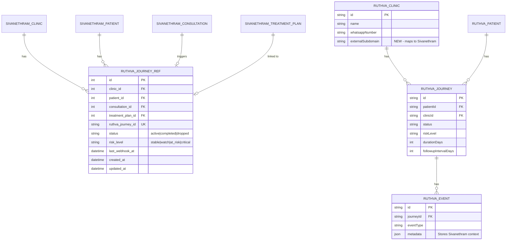

# Sivanethram-Ruthva Integration

## Enhancement Summary

**Deepened on:** 2026-03-12
**Agents used:** Security Sentinel, Architecture Strategist, Performance Oracle, Data Integrity Guardian, TypeScript Reviewer (Kieran), Python Reviewer (Kieran), Simplicity Reviewer, Agent-Native Reviewer, Best Practices Researcher, Learnings Researcher, Deployment Verifier

### Key Improvements from Deepening

1. **CRITICAL Security Fix**: Phone hashing must use HMAC with a secret salt, not bare SHA-256 (rainbow table attack on 10B Indian phone numbers)
2. **CRITICAL Security Fix**: `webhookUrl` field must have SSRF protection (allowlist validation)
3. **Simplified Auth**: Dropped HMAC webhook signatures for V1 — reuse same `X-Ruthva-Secret` header both directions (Simplicity Reviewer)
4. **Simplified Idempotency**: Use DB unique constraint `@@unique([clinicId, patientId, status])` where status=active, instead of separate idempotency key mechanism (Simplicity Reviewer)
5. **Performance Fix**: Batch cron queries to eliminate N+1 storm before adding webhook firing (Performance Oracle)
6. **Django Model Fix**: `RuthvaJourneyRef` now includes `updated_at`, `TenantQuerySetMixin`, status choices, and unique constraint (Python Reviewer)
7. **TypeScript Fix**: Use `crypto.timingSafeEqual()` for secret comparison; fix existing `any` in events.ts (TypeScript Reviewer)
8. **Deployment Order**: Ruthva deploys first (new endpoint + migration), then Sivanethram (new model + service), with env vars configured before either (Deployment Verifier)
9. **Agent-Native Gaps Documented**: 5 UI actions lack API equivalents — documented as V2 debt

### New Risks Discovered

- Unsalted phone hash is reversible in hours on commodity hardware
- `webhookUrl` stored on Clinic model is an SSRF vector if attacker gains admin access
- N+1 query pattern in cron jobs will be amplified when webhook firing is added per state change
- Django URL shadowing risk when adding new endpoints (institutional learning)

---

## Overview

Connect Sivanethram (Django Clinic OS) with Ruthva (Next.js Treatment Continuity Engine) so that doctors experience one seamless workflow: consultation → prescription → treatment journey → automated follow-up. Sivanethram captures the clinical context; Ruthva runs the treatment lifecycle via WhatsApp.

The doctor never leaves Sivanethram. Ruthva operates as an invisible engine.

(see brainstorm: `docs/brainstorms/integration-strategy.md`, `docs/brainstorms/sivanethram-and-ruthva.md`, `docs/brainstorms/clinic-os-integration.md`)

## Problem Statement

Today, Sivanethram and Ruthva are separate products with separate logins. A doctor who finishes a consultation in Sivanethram must context-switch to Ruthva to set up patient follow-up. This friction means most doctors never start treatment journeys, and patients drop off without intervention.

AYUSH treatments depend on adherence over long cycles (21–90 days). Follow-up is part of treatment itself, not optional infrastructure. The doctor expects one continuous flow from consultation to automated follow-up.

## Proposed Solution

A **two-layer integration** where Sivanethram is the UI shell and Ruthva is the execution engine:

```
Doctor finishes consultation in Sivanethram
  → Clicks "Start Treatment Journey"
  → Modal: duration, follow-up interval, consent checkbox
  → Sivanethram backend POSTs to Ruthva API (server-to-server)
  → Ruthva creates patient + journey + scheduled events
  → WhatsApp engagement runs automatically
  → Ruthva webhooks status back to Sivanethram
  → Doctor sees journey status on patient timeline
```

## Technical Approach

### Architecture

```
┌─────────────────────────────────────────────────┐
│  Sivanethram (Django + Next.js Frontend)        │
│                                                 │
│  Consultation → [Start Journey] → Modal         │
│       │                              │          │
│       ▼                              ▼          │
│  Django Backend ──POST──► Ruthva API            │
│       ▲            X-Ruthva-Secret              │
│       │                              │          │
│  Webhook Receiver ◄──POST── Ruthva Webhooks     │
│       │            X-Ruthva-Secret              │
│  Patient Timeline / Dashboard Widget            │
└─────────────────────────────────────────────────┘

┌─────────────────────────────────────────────────┐
│  Ruthva (Next.js + Prisma)                      │
│                                                 │
│  POST /api/integration/journeys/start           │
│       │                                         │
│  Resolve clinic → Resolve/create patient        │
│       → Create journey + visit_expected events  │
│       → Return journey_id + status              │
│                                                 │
│  Nightly cron → WhatsApp messaging              │
│       → Risk assessment → Webhooks out          │
└─────────────────────────────────────────────────┘
```

#### Research Insights (Architecture Strategist)

- The two-layer approach is architecturally sound. The rejected alternatives (monolith, shared DB, iframe, message queue) are well-reasoned.
- **Clinic provisioning needs a concrete workflow**: The plan says "pre-provisioned via admin setup step" but doesn't define how. For V1, a simple CLI script or Prisma Studio update is sufficient. Document the exact steps.
- **Consider adding a `sourceSystem` field on Journey**: This distinguishes journeys created via integration from those created directly in Ruthva, enabling analytics and debugging.
- **Webhook-based eventual consistency is the right call** for V1. The `GET /api/integration/journeys/[id]/status` endpoint provides a reconciliation mechanism if webhooks are missed.

### Authentication Model

**Server-to-server only.** No user-level auth crosses the boundary.

- Sivanethram attaches `X-Ruthva-Secret` header (shared env var `RUTHVA_INTEGRATION_SECRET`)
- Ruthva validates the header in a reusable `validateIntegrationSecret()` utility
- **Same secret used for both directions** — Ruthva sends `X-Ruthva-Secret` on webhook calls to Sivanethram too
- One global secret for V1 (single deployment). Per-clinic API keys in V2 if multi-deployment is needed.
- Follows the same pattern as Ruthva's existing cron auth (`x-cron-secret` in `/api/cron/route.ts`)

#### Research Insights (Security Sentinel + Simplicity Reviewer)

**Simplified from original plan**: The original plan proposed HMAC-SHA256 signatures for webhooks plus shared secret for inbound. The Simplicity Reviewer correctly identified this as unnecessary complexity for V1:
- Both systems are on infrastructure you control
- All traffic is over HTTPS (transport-layer integrity)
- The same `X-Ruthva-Secret` header works for both directions
- HMAC adds signing/verification code in two languages (Node.js + Python) with subtle JSON serialization mismatch risks
- **Decision**: Use `X-Ruthva-Secret` for both directions. Introduce HMAC signing only if per-clinic keys are needed in V2.

**MUST use timing-safe comparison** (TypeScript Reviewer):
```typescript
// src/lib/integration-auth.ts
import { timingSafeEqual } from "crypto";

export function validateIntegrationSecret(request: Request): boolean {
  const provided = request.headers.get("x-ruthva-secret");
  const expected = process.env.RUTHVA_INTEGRATION_SECRET;
  if (!provided || !expected) return false;
  if (provided.length !== expected.length) return false;
  return timingSafeEqual(Buffer.from(provided), Buffer.from(expected));
}
```

**Secret rotation** (Security Sentinel): Support dual secrets during rotation. Accept either `RUTHVA_INTEGRATION_SECRET` or `RUTHVA_INTEGRATION_SECRET_OLD` during a transition window. Remove `_OLD` after confirming both systems use the new secret.

### Clinic Identity Resolution

**New field on Ruthva's `Clinic` model: `externalSubdomain`** (optional, unique when set).

- On `POST /api/integration/journeys/start`, Ruthva looks up `clinic` by `externalSubdomain`
- Clinics must be **pre-provisioned** via an admin setup step (not auto-created)
- This avoids the problem of auto-creating a Clinic without a `userId` or `whatsappNumber`
- Admin setup: link a Sivanethram subdomain to an existing Ruthva clinic

**Prisma schema additions:**
```prisma
model Clinic {
  // ... existing fields
  externalSubdomain String?  @unique  // Sivanethram subdomain mapping
  webhookUrl        String?           // Where to send status webhooks
  sourceSystem      String?           // "sivanethram" or null for native
}
```

#### Research Insights (Security Sentinel — SSRF Risk)

**`webhookUrl` is an SSRF vector.** If an attacker gains write access to the Clinic record (admin compromise, SQL injection), they could set `webhookUrl` to an internal service URL (e.g., `http://169.254.169.254/` for cloud metadata, or `http://localhost:5432/` for the database).

**Mitigation (from Sivanethram institutional learning: `weasyprint-logo-url-ssrf-allowlist-mitigation.md`):**
- Validate `webhookUrl` at write-time AND at fire-time
- Apply allowlist: must match `https://*.sivanethram.com` or a configured pattern
- Reject private IP ranges (10.x, 172.16-31.x, 192.168.x, 127.x, 169.254.x)
- For V1 with single deployment: hardcode the Sivanethram webhook URL in env var `SIVANETHRAM_WEBHOOK_URL` instead of storing on the model. This eliminates the SSRF risk entirely.

**V1 Recommendation**: Use `SIVANETHRAM_WEBHOOK_URL` env var. Drop `webhookUrl` from the Clinic model. Reintroduce per-clinic webhook URLs in V2 with proper SSRF validation.

### Patient Matching & Creation

- **Canonical identifier**: `whatsapp_number` from Sivanethram (fall back to `phone` if empty)
- **Unique constraint**: `[clinicId, phoneHash]` (already exists)
- **Flow**: Find existing patient by hash → if not found, create with `consentGiven: true`
- **Consent**: Captured in the Sivanethram modal (checkbox: "Patient consents to WhatsApp follow-up"). Passed as `consent_given: true` in payload. Ruthva trusts Sivanethram's assertion.

#### Research Insights (Security Sentinel + Data Integrity Guardian — CRITICAL)

**Phone hashing MUST be salted.** The current `hashPhone()` uses bare SHA-256:

```typescript
// CURRENT (VULNERABLE)
return createHash("sha256").update(phone.trim()).digest("hex");
```

Indian mobile numbers are 10 digits (~10B combinations). An attacker with database read access can precompute a complete rainbow table in hours. This is a **patient PII breach waiting to happen**.

**Fix**: Use HMAC-SHA256 with a server-side secret:
```typescript
// FIXED
import { createHmac } from "crypto";

export function hashPhone(phone: string): string {
  const secret = process.env.PHONE_HASH_SECRET;
  if (!secret) throw new Error("PHONE_HASH_SECRET not configured");
  return createHmac("sha256", secret).update(phone.trim()).digest("hex");
}
```

**Migration impact**: All existing `phoneHash` values must be recomputed. This is a one-time data migration that must run before the integration goes live:
1. Add `PHONE_HASH_SECRET` env var
2. Create migration script: for each patient, recompute `phoneHash` using HMAC
3. Run script during maintenance window (sub-minute for hundreds of patients)

**This fix applies to existing Ruthva, not just the integration.** It should be done as a prerequisite task.

### Journey Creation

- Reuse existing `createJourneyWithEvents()` from `src/lib/events.ts`
- Stores Sivanethram context (consultation_id, record_id, diagnosis, treatment_plan) in the `journey_started` event's `metadata` JSON field
- **Active journey guard**: If patient already has an active journey, return 409 with existing journey details. Doctor sees the existing journey status in the modal.

#### Research Insights (Simplicity Reviewer)

**Simplified idempotency**: The original plan proposed a separate idempotency key mechanism (`SHA256(subdomain + record_id + consultation_date)` as header). This is over-engineered.

**Simpler approach**: The active journey guard already provides natural idempotency:
- If patient has an active journey → return 409 with existing journey details
- If no active journey → create one
- Double-click scenario: first request creates journey, second gets 409 with the same journey ID
- This covers the real use case without additional infrastructure

**Drop the `X-Idempotency-Key` header entirely for V1.**

#### Research Insights (TypeScript Reviewer)

**Fix existing `any` type in `events.ts:275`** before building on this module:
```typescript
// BEFORE
const baseUpdate: any = { ... };
// AFTER
const baseUpdate: Prisma.JourneyUpdateInput = { ... };
```

**Add `sourceSystem` to journey metadata** to distinguish integration-created journeys:
```typescript
// In the integration endpoint
const metadata = {
  source: "sivanethram",
  consultation_id: payload.context.consultation_id,
  record_id: payload.patient.record_id,
  // ... other context
};
```

### Webhook Contract (Ruthva → Sivanethram)

**Events fired**: `visit_missed`, `risk_level_changed`, `patient_returned`, `journey_completed`, `journey_dropped`

**Payload schema:**
```json
{
  "event_type": "visit_missed",
  "clinic_subdomain": "myclinic",
  "patient_record_id": "PAT-2026-0001",
  "journey_id": "clxyz...",
  "timestamp": "2026-03-10T18:30:00+05:30",
  "data": {
    "risk_level": "at_risk",
    "missed_visits": 2,
    "next_visit_date": "2026-03-12"
  }
}
```

**Security**: Same `X-Ruthva-Secret` header used for inbound API calls. Sivanethram verifies with timing-safe comparison.

**Retry policy**: 3 retries with exponential backoff (5s, 30s, 5min). Failed webhooks logged as events. No dead letter queue in V1.

**Endpoint**: Hardcoded via `SIVANETHRAM_WEBHOOK_URL` env var (not per-clinic `webhookUrl` — see SSRF mitigation above).

#### Research Insights (Best Practices Researcher)

**Stripe/GitHub webhook patterns to follow:**
- Include a unique `event_id` (UUID) in each webhook payload for dedup on the receiving side
- Include `attempt_number` (1, 2, 3) so Sivanethram knows if it's a retry
- Sivanethram should return 200 immediately, then process async (from WhatsApp webhook institutional learning)
- Log the full payload on send and on receive for debugging cross-system issues
- Add `webhook_url_verified` timestamp on Clinic to confirm reachability during setup

**Updated payload schema with event_id:**
```json
{
  "event_id": "evt_abc123",
  "event_type": "visit_missed",
  "attempt": 1,
  "clinic_subdomain": "myclinic",
  "patient_record_id": "PAT-2026-0001",
  "journey_id": "clxyz...",
  "timestamp": "2026-03-10T18:30:00+05:30",
  "data": { ... }
}
```

### Sivanethram Data Model for Integration State

**New Django model: `RuthvaJourneyRef`**

#### Research Insights (Python Reviewer — Kieran)

The original model was missing several patterns used consistently across the Sivanethram codebase. Enhanced version:

```python
class JourneyStatus(models.TextChoices):
    ACTIVE = "active", "Active"
    COMPLETED = "completed", "Completed"
    DROPPED = "dropped", "Dropped"

class RiskLevel(models.TextChoices):
    STABLE = "stable", "Stable"
    WATCH = "watch", "Watch"
    AT_RISK = "at_risk", "At Risk"
    CRITICAL = "critical", "Critical"

class RuthvaJourneyRef(TenantModelMixin, models.Model):
    """Maps a Sivanethram consultation to a Ruthva treatment journey."""
    clinic = models.ForeignKey(Clinic, on_delete=models.CASCADE, related_name="ruthva_journeys")
    consultation = models.ForeignKey(
        "consultations.Consultation", on_delete=models.CASCADE,
        related_name="ruthva_journey", null=True
    )
    treatment_plan = models.ForeignKey(
        "treatments.TreatmentPlan", on_delete=models.SET_NULL,
        null=True, blank=True, related_name="ruthva_journey"
    )
    patient = models.ForeignKey(
        "patients.Patient", on_delete=models.CASCADE,
        related_name="ruthva_journeys"
    )
    ruthva_journey_id = models.CharField(max_length=100, db_index=True)
    status = models.CharField(max_length=20, choices=JourneyStatus.choices, default=JourneyStatus.ACTIVE)
    risk_level = models.CharField(max_length=20, choices=RiskLevel.choices, default=RiskLevel.STABLE)
    last_webhook_at = models.DateTimeField(null=True, blank=True)
    created_at = models.DateTimeField(auto_now_add=True)
    updated_at = models.DateTimeField(auto_now=True)  # Was missing in original plan

    class Meta:
        constraints = [
            models.UniqueConstraint(
                fields=["clinic", "ruthva_journey_id"],
                name="unique_ruthva_journey_per_clinic"
            ),
        ]
        ordering = ["-created_at"]

    def __str__(self):
        return f"Journey {self.ruthva_journey_id} ({self.status})"
```

**Key improvements from Python Reviewer:**
- Added `updated_at` (every model in the codebase has this)
- Used `TenantModelMixin` (matches existing multi-tenant pattern)
- Added `TextChoices` for status and risk_level (prevents typo-based bugs)
- Added `related_name` on all FKs (enables reverse lookups)
- Added `db_index` on `ruthva_journey_id` (queried on webhook receipt)
- Added `UniqueConstraint` (prevents duplicate refs)
- Added `ordering` (default sort by newest)

---

## Implementation Phases

### Phase 0: Prerequisites (Before Integration Work)

| # | Task | File | Priority |
|---|------|------|----------|
| 0a | **Salt phone hashing** — migrate `hashPhone()` to HMAC-SHA256 with `PHONE_HASH_SECRET` | `src/lib/crypto.ts` | CRITICAL |
| 0b | Recompute all existing `phoneHash` values with new HMAC function | Migration script | CRITICAL |
| 0c | Fix `any` type in `createActivatedJourney` base update | `src/lib/events.ts:275` | HIGH |
| 0d | Configure `RUTHVA_INTEGRATION_SECRET` env var in both systems | Railway + Sivanethram hosting | HIGH |
| 0e | Configure `SIVANETHRAM_WEBHOOK_URL` env var in Ruthva | Railway | HIGH |
| 0f | Configure `PHONE_HASH_SECRET` env var in Ruthva | Railway | CRITICAL |

### Phase 1: End-to-End Flow (API + Service + Button + Modal + Status Badge)

**Goal**: Doctor can trigger a treatment journey from Sivanethram and see its current status -- shippable standalone.

#### Ruthva Changes

| # | Task | File |
|---|------|------|
| 1 | Add `externalSubdomain` field to Clinic model (drop `webhookUrl` — use env var) | `prisma/schema.prisma` |
| 2 | Run Prisma migration | `prisma/migrations/` |
| 3 | Create `validateIntegrationSecret()` with timing-safe comparison | `src/lib/integration-auth.ts` (new) |
| 4 | Create Zod schema for integration payload | `src/lib/validations.ts` |
| 5 | Create `POST /api/integration/journeys/start` endpoint | `src/app/api/integration/journeys/start/route.ts` (new) |
| 6 | Implement: validate secret → resolve clinic by subdomain → resolve/create patient → check active journey guard → create journey with events → return journey ID | Same file |
| 7 | Create `GET /api/integration/journeys/[id]/status` endpoint | `src/app/api/integration/journeys/[id]/status/route.ts` (new) |
| 8 | Link Sivanethram subdomain to Ruthva clinic via Prisma Studio or script | One-time setup |

#### Sivanethram Backend Changes

| # | Task | File |
|---|------|------|
| 9 | Create `integrations` Django app | `backend/integrations/` (new app) |
| 10 | Create `RuthvaJourneyRef` model with full patterns (see above) + migration | `backend/integrations/models.py` |
| 11 | Create `RuthvaService` class (first external HTTP client) | `backend/integrations/services.py` (new) |
| 12 | Implement: format payload → POST to Ruthva → handle errors → store journey ref | Same file |
| 13 | Create API endpoint `POST /api/v1/integrations/journeys/start/` | `backend/integrations/views.py` (new) |
| 14 | Create serializer for the request (consultation_id, duration, interval, consent) | `backend/integrations/serializers.py` (new) |
| 15 | Register URL patterns (**use unique paths — see Django URL shadowing learning**) | `backend/integrations/urls.py` (new) |

#### Sivanethram UI Changes

| # | Task | File |
|---|------|------|
| 16 | Add "Start Treatment Journey" button to consultation/patient view | `frontend/src/components/` (TBD based on existing views) |
| 17 | Create journey configuration modal (duration, interval, consent checkbox, optional notes) | `frontend/src/components/JourneyModal.tsx` (new) |
| 18 | Wire modal to `useMutation` calling `POST /api/v1/integrations/journeys/start/` | Same file |
| 19 | Handle all error states in modal (409 shows existing journey, 400 shows validation errors, timeout shows retry) | Same file |
| 20 | Add journey status badge to patient record view (polls Ruthva status endpoint via Sivanethram proxy) | `frontend/src/components/` |

#### Research Insights (Django Learnings — URL Shadowing)

From `docs/solutions/logic-errors/django-duplicate-url-pattern-shadowing-405.md`:
- Django's URL resolver matches on path string alone, top-to-bottom, never considers HTTP method
- Use a distinct URL prefix: `/api/v1/integrations/` (not `/api/v1/journeys/` which could shadow existing routes)
- If webhook receiving and API endpoints share a path prefix, use a single class-based view for method dispatch
- Add CI test for URL path uniqueness (example in the learning doc)

#### Testing

- [x] Ruthva: integration endpoint accepts valid payload, creates patient + journey
- [x] Ruthva: returns 409 when patient has active journey (with existing journey details)
- [x] Ruthva: returns 401 with invalid/missing secret
- [x] Ruthva: returns 401 with timing-safe comparison (no timing leaks)
- [x] Ruthva: returns 400 for invalid payload (missing fields, bad phone format)
- [x] Ruthva: duplicate request returns 409 with same journey (natural idempotency)
- [x] Ruthva: patient without whatsapp_number falls back to phone field
- [ ] Sivanethram: service class formats correct payload from consultation data
- [ ] Sivanethram: stores `RuthvaJourneyRef` on success
- [ ] Sivanethram: handles Ruthva down (timeout, 500) gracefully with user-facing error
- [ ] Sivanethram: URL patterns don't shadow existing routes
- [ ] Modal opens from consultation view with correct patient context
- [ ] Modal shows consent checkbox (mandatory — disabled submit until checked)
- [ ] Modal submits and shows success confirmation with journey details
- [ ] Modal shows clear error for each failure mode (409, 400, timeout, network error)
- [ ] Patient record shows journey status badge (active/completed/dropped)
- [ ] "Retry" button appears if initial request failed
- [ ] Button is disabled/hidden if patient has no phone number
- [ ] End-to-end: Sivanethram button → modal → POST → Ruthva creates journey → WhatsApp cron sends first message

---

### Phase 2: Webhook Loop + Dashboard Visibility (Real-Time Updates + Risk Indicators)

**Goal**: Doctor sees real-time journey status updates, risk alerts, and timeline entries in Sivanethram without checking Ruthva.

#### Ruthva Changes

| # | Task | File |
|---|------|------|
| 1 | **Batch cron queries first** — refactor `detectMissedVisits` to use single query with includes instead of N+1 | `src/lib/cron/detect-missed-visits.ts` |
| 2 | Create `fireWebhook()` utility (HTTP POST + `X-Ruthva-Secret` header + retry logic + event logging) | `src/lib/webhooks.ts` (new) |
| 3 | Add webhook firing to cron jobs at critical state changes: `computeRiskLevels` (risk_level_changed), `detectMissedVisits` (visit_missed), `completeExpiredJourneys` (journey_completed/dropped) | `src/lib/cron/*.ts` |
| 4 | Add webhook firing when patient returns via WhatsApp or staff action | `src/lib/events.ts` (in `confirmVisit`) |
| 5 | Add new EventType values: `webhook_sent`, `webhook_failed` | `prisma/schema.prisma` |
| 6 | Only fire webhooks for clinics with `externalSubdomain` set (skip native Ruthva clinics) | `src/lib/webhooks.ts` |

#### Research Insights (Performance Oracle — CRITICAL)

**Must fix N+1 query pattern in cron before adding webhooks:**

The current `detectMissedVisits` fetches all `visit_expected` events, then for EACH event executes 2 additional queries (check `visit_confirmed`, check `visit_missed`). With 50 patients on 7-day intervals over 90-day journeys, that's ~1,200 sequential DB round trips.

Adding webhook firing per missed visit would add another HTTP call per iteration, making the cron job even slower.

**Fix**: Batch the detection query:
```typescript
// Instead of N+1, use a single query with NOT EXISTS subquery
const missedVisits = await db.$queryRaw`
  SELECT ve.* FROM "Event" ve
  JOIN "Journey" j ON ve."journeyId" = j.id
  WHERE ve."eventType" = 'visit_expected'
    AND ve."eventDate" < CURRENT_DATE
    AND j.status = 'active'
    AND NOT EXISTS (
      SELECT 1 FROM "Event" vc
      WHERE vc."journeyId" = ve."journeyId"
        AND vc."eventDate" = ve."eventDate"
        AND vc."eventType" IN ('visit_confirmed', 'visit_missed')
    )
`;
```

**Batch webhook firing**: Collect all state changes in the cron run, then fire webhooks in a single batch at the end (not inline per change). This separates the state computation from the notification delivery.

#### Sivanethram Backend Changes

| # | Task | File |
|---|------|------|
| 7 | Create webhook receiving endpoint `POST /api/v1/integrations/webhooks/ruthva/` | `backend/integrations/views.py` |
| 8 | Verify `X-Ruthva-Secret` header with timing-safe comparison | Same file |
| 9 | Return 200 immediately, process webhook async (from WhatsApp learning) | Same file |
| 10 | Update `RuthvaJourneyRef` with latest status/risk from webhook data | Same file |
| 11 | Deduplicate webhooks by `event_id` (store last processed event_id) | Same file |

#### Sivanethram UI Changes

| # | Task | File |
|---|------|------|
| 12 | Add journey timeline entries from `RuthvaJourneyRef` to patient timeline | `frontend/src/components/` |
| 13 | Add "View Journey" link that fetches live status from Sivanethram backend (which proxies to Ruthva) | `frontend/src/components/` |
| 14 | Create dashboard widget: "Treatment Journey Alerts" showing recent webhook events | `frontend/src/components/` |
| 15 | Add risk indicators to patient list (e.g., red dot for `at_risk`/`critical`) | `frontend/src/components/` |

#### Testing

- [ ] Ruthva fires webhook on risk level change (only for integrated clinics)
- [ ] Ruthva fires webhook on missed visit
- [ ] Ruthva fires webhook on journey completion/drop
- [ ] Ruthva retries on Sivanethram 500/timeout (up to 3 times, exponential backoff)
- [ ] Ruthva logs webhook_sent/webhook_failed events
- [ ] Sivanethram verifies X-Ruthva-Secret (rejects invalid with timing-safe comparison)
- [ ] Sivanethram returns 200 immediately
- [ ] Sivanethram updates RuthvaJourneyRef on valid webhook
- [ ] Sivanethram deduplicates by event_id
- [ ] Patient timeline shows journey events from webhooks
- [ ] Patient record shows risk level from webhook data (at_risk/critical)
- [ ] Dashboard widget shows recent alerts
- [ ] Patient list shows risk indicators
- [ ] Cron completes in < 30 seconds with webhook firing (performance gate)

---

## Alternative Approaches Considered

### A: Full Monolith Merge

Combine both codebases into one application.

**Rejected because**: Creates a bloated clinic management system with no pricing power. Loses the strategic advantage of the "treatment continuity layer" as a distinct product. Increases maintenance burden. (see brainstorm: `docs/brainstorms/sivanethram-and-ruthva.md`)

### B: Frontend-Only Integration (iframe/micro-frontend)

Embed Ruthva's UI inside Sivanethram via iframe or Module Federation.

**Rejected because**: Creates a fragmented UX (two auth systems, two design languages). Does not solve the data flow problem — the doctor still has to manually enter patient data in Ruthva. Does not enable automated journey creation from consultation context.

### C: Shared Database

Both systems read/write to the same PostgreSQL database.

**Rejected because**: Tight coupling between Django and Prisma schemas. Migration conflicts. No clear ownership of tables. Would require abandoning either Django ORM or Prisma. Creates a maintenance nightmare.

### D: Message Queue (RabbitMQ/Redis Streams)

Sivanethram publishes events, Ruthva subscribes.

**Rejected because**: Over-engineered for V1 with a single deployment. Adds infrastructure complexity. The integration is fundamentally request-response (start journey → get journey ID), not event-driven. Webhooks cover the async direction adequately.

**Chosen approach**: HTTP API bridge with server-to-server auth, matching existing codebase patterns in both systems.

---

## System-Wide Impact

### Interaction Graph

```
Doctor clicks "Start Journey" in Sivanethram frontend
  → Sivanethram Next.js → Django API (POST /api/v1/integrations/journeys/start/)
  → Django RuthvaService → Ruthva API (POST /api/integration/journeys/start)
  → Ruthva: validateIntegrationSecret() → resolve clinic → resolve/create patient
  → Ruthva: createJourneyWithEvents() → creates Journey + Events in transaction
  → Response flows back: journey_id → RuthvaJourneyRef created → modal shows success

Nightly cron (Ruthva):
  → detectMissedVisits (batched) → computeRiskLevels → collect state changes
  → fireWebhooks (batched) → Sivanethram webhook endpoint → update RuthvaJourneyRef

Patient WhatsApp reply:
  → Meta webhook → Ruthva /api/webhooks/whatsapp → match patient → update journey
  → If state change → fireWebhook() → Sivanethram updated
```

### Error & Failure Propagation

| Error Source | Handling | User Impact |
|---|---|---|
| Ruthva unreachable (timeout) | Sivanethram shows "try again later" with retry button | Treatment plan proceeds without journey. |
| Invalid payload (400) | Sivanethram shows validation error details | Doctor corrects input (e.g., missing phone) |
| Active journey exists (409) | Modal shows existing journey details | Doctor sees patient is already tracked |
| Invalid secret (401) | Sivanethram logs error, shows generic error | Admin must verify env var configuration |
| Webhook delivery fails | Ruthva retries 3x, logs `webhook_failed` event | Sivanethram data becomes stale until next successful webhook |
| WhatsApp send fails | Ruthva logs `*_failed` event, continues cron | Patient doesn't receive message; next cron cycle retries |

### State Lifecycle Risks

- **Partial failure during journey creation**: `createJourneyWithEvents()` runs in a Prisma `$transaction`, so either all records are created or none. No orphaned state.
- **RuthvaJourneyRef without actual journey**: If Sivanethram stores a ref but Ruthva's response was lost (network issue after creation), the ref points to a valid journey but Sivanethram doesn't know. Mitigated by the `GET /api/integration/journeys/[id]/status` endpoint for verification.
- **Webhook ordering**: If `risk_level_changed` arrives before `visit_missed`, Sivanethram's cached state may show risk without the missed visit context. Acceptable for V1 — each webhook carries full current state, not just the delta.

### API Surface Parity

| Capability | Ruthva Direct | Via Integration API | Agent-Native? |
|---|---|---|---|
| Create patient + start journey | `POST /api/patients` | `POST /api/integration/journeys/start` | Yes |
| View journey status | Dashboard UI | `GET /api/integration/journeys/[id]/status` | Yes |
| Cancel journey | Not exposed | Not in V1 | **No — V2 gap** |
| Confirm visit | `POST /api/journeys/confirm-visit` | Not in V1 | **No — V2 gap** |
| Activate mid-treatment | `POST /api/patients/activate` | Not planned | **No — V2 gap** |
| List journeys by clinic | Dashboard UI | Not planned | **No — V2 gap** |
| Bulk start journeys | N/A | Not planned | **No — V2 gap** |

#### Research Insights (Agent-Native Reviewer)

5 gaps where a UI action exists but no integration API equivalent. Documented as V2 debt. The most impactful gap is **journey cancellation** — if a doctor cancels a treatment plan in Sivanethram, there's no way to tell Ruthva to stop sending WhatsApp messages. This should be the first V2 integration endpoint.

### Integration Test Scenarios

1. **Full lifecycle**: Sivanethram creates journey → cron runs → WhatsApp sends adherence check → patient replies "yes" → cron computes stable risk → journey completes after duration → webhook fires `journey_completed` → Sivanethram shows "Completed"
2. **Drop-off recovery**: Journey started → patient misses 2 visits → risk escalates to `critical` → webhook fires `risk_level_changed` → Sivanethram shows alert → recovery message sent → patient returns → webhook fires `patient_returned`
3. **Duplicate prevention**: Doctor clicks "Start" twice → first request creates journey → second request returns 409 with same journey ID → only one set of WhatsApp messages sent
4. **Cross-system patient match**: Patient exists in Sivanethram with phone +91-9876543210 → first journey creates Ruthva patient → second consultation for same patient → integration endpoint finds existing patient → creates new journey (if old one completed)
5. **Webhook resilience**: Sivanethram goes down → Ruthva fires webhook → 3 retries fail → `webhook_failed` event logged → Sivanethram comes back → next state change triggers new webhook with current state

---

## Acceptance Criteria

### Functional Requirements

- [ ] Doctor can click "Start Treatment Journey" from a consultation in Sivanethram
- [ ] Modal collects: duration (days), follow-up interval (days), consent checkbox
- [ ] Submitting the modal creates a patient + journey in Ruthva via API
- [ ] Journey ID is stored in Sivanethram's `RuthvaJourneyRef`
- [ ] WhatsApp messages are sent automatically by Ruthva's cron system
- [ ] Doctor sees journey status on the patient record in Sivanethram
- [ ] Critical events (missed visit, risk change, completion, drop) appear on patient timeline
- [ ] Duplicate journey prevention: 409 if patient has active journey
- [ ] Patient consent checkbox is mandatory before submission

### Non-Functional Requirements

- [ ] Integration API responds within 2 seconds (journey creation)
- [ ] Webhook delivery within 30 seconds of state change
- [ ] Shared secret is stored in environment variables, never in code
- [ ] Phone hashing uses HMAC-SHA256 with server-side secret (not bare SHA-256)
- [ ] Secret comparison uses timing-safe equality
- [ ] Rate limiting on integration endpoint (100 req/hour per clinic)
- [ ] Cron job completes in < 30 seconds including webhook firing

### Quality Gates

- [ ] Unit tests for Ruthva integration endpoint (auth, validation, creation, active journey guard)
- [ ] Unit tests for Sivanethram `RuthvaService` (payload formatting, error handling)
- [ ] Unit tests for secret verification (timing-safe, both systems)
- [ ] Integration test: full lifecycle (create journey → cron → webhook → status update)
- [ ] Manual test: end-to-end with real WhatsApp sandbox
- [ ] Performance test: cron with 50 patients completes in < 30s
- [ ] No new Django URL path shadowing (CI check)

---

## Success Metrics

- **Adoption**: % of consultations that result in a treatment journey being started
- **Engagement**: Patient response rate to WhatsApp adherence checks
- **Retention**: Reduction in patient drop-off rate compared to non-journey patients
- **UX**: Doctor completes "Start Journey" flow in < 30 seconds
- **Reliability**: < 1% webhook delivery failure rate

---

## Dependencies & Prerequisites

| Dependency | Owner | Status |
|---|---|---|
| Ruthva deployed and accessible from Sivanethram's server | Infra | Ruthva is on Railway |
| Meta-approved WhatsApp templates for adherence/reminders | Product | Already approved |
| Sivanethram consultation flow working | Dev | Done |
| Ruthva cron system working | Dev | Done |
| `RUTHVA_INTEGRATION_SECRET` env var in both systems | DevOps | Not started |
| `SIVANETHRAM_WEBHOOK_URL` env var in Ruthva | DevOps | Not started |
| `PHONE_HASH_SECRET` env var in Ruthva | DevOps | Not started |
| Phone hash migration (HMAC) completed | Dev | Not started |
| `events.ts:275` `any` type fixed | Dev | Not started |
| Ruthva clinic pre-provisioned with `externalSubdomain` set | Admin | Not started |

---

## Deployment Order (Deployment Verifier)

**Sequence matters. Follow this order:**

### Step 1: Environment Variables (both systems)
```
Ruthva (Railway):
  RUTHVA_INTEGRATION_SECRET=<generate 64-char random string>
  SIVANETHRAM_WEBHOOK_URL=https://<sivanethram-domain>/api/v1/integrations/webhooks/ruthva/
  PHONE_HASH_SECRET=<generate 64-char random string>

Sivanethram:
  RUTHVA_INTEGRATION_SECRET=<same value as above>
  RUTHVA_API_URL=https://<ruthva-domain>
```

### Step 2: Deploy Ruthva (new endpoint is additive — no breaking changes)
1. Run Prisma migration (adds `externalSubdomain` to Clinic)
2. Deploy new integration endpoint code
3. Verify: `curl -X POST <ruthva>/api/integration/journeys/start -H "X-Ruthva-Secret: wrong"` → 401
4. Link clinic: set `externalSubdomain` on the target Ruthva clinic via Prisma Studio

### Step 3: Deploy Sivanethram (new app is additive — no breaking changes)
1. Run Django migration (creates `RuthvaJourneyRef` table)
2. Deploy new `integrations` app code
3. Verify: test the journey start endpoint via Django shell or API client

### Step 4: Verify End-to-End
1. Start a journey from Sivanethram → confirm patient + journey created in Ruthva
2. Wait for cron → confirm WhatsApp message sent
3. Trigger webhook → confirm RuthvaJourneyRef updated

### Rollback Plan
- Ruthva: revert deployment (endpoint simply stops being available — Sivanethram gets 404, shows "try again later")
- Sivanethram: revert deployment (button/modal disappears — no data loss since RuthvaJourneyRef is additive)
- Neither rollback causes data corruption — worst case is stale webhook data

---

## Risk Analysis & Mitigation

| Risk | Probability | Impact | Mitigation |
|---|---|---|---|
| **Unsalted phone hash reversed** | High (if DB leaked) | Critical | Migrate to HMAC-SHA256 with secret salt (Phase 0 prerequisite) |
| **SSRF via webhookUrl** | Medium | High | Use env var `SIVANETHRAM_WEBHOOK_URL` instead of DB field for V1 |
| **WhatsApp rate limits** | Low (V1 single clinic) | High | Monitor Meta API codes. Per-clinic throttling in V2. |
| **Shared secret leaked** | Low | Critical | Rotate via dual-secret mechanism. Env var only. Never logged. |
| **Duplicate WhatsApp messages** | Medium | Medium | Active journey guard provides natural idempotency. Daily dedup in cron. |
| **Webhook data staleness** | Medium | Low | `GET /api/integration/journeys/[id]/status` for live reconciliation. |
| **Cross-clinic patient matching** | High (existing bug) | High | Fix `findFirst({ where: { phone } })` to scope by clinic before multi-clinic. |
| **Timezone mismatch** | Medium | Medium | All clinics are IST in V1. Store clinic timezone for V2. |
| **Cron timeout with webhooks** | Medium | Medium | Batch queries + batch webhook firing. Performance gate: < 30s. |
| **Django URL shadowing** | Low | Medium | Use `/api/v1/integrations/` prefix. CI test for URL uniqueness. |

---

## Known Gaps (Deferred to V2)

- **Journey cancellation from Sivanethram** (highest priority V2 item): Doctor cannot cancel/pause a journey. Needs `POST /api/integration/journeys/[id]/cancel`
- **Multi-language WhatsApp templates**: Currently English only. Need Meta-approved templates in Tamil, Hindi, etc.
- **Per-clinic WhatsApp numbers**: All clinics share one WABA sending number in V1
- **Per-clinic API keys / secret separation**: V1 decision: single shared `RUTHVA_INTEGRATION_SECRET` for both API auth (inbound) and webhook signing (outbound). Split into `RUTHVA_INTEGRATION_API_KEY` + `RUTHVA_WEBHOOK_SIGNING_KEY` when adding per-clinic keys in V2. All comparisons use `timingSafeEqual` (see `src/lib/secrets.ts`).
- **Backdated journey start**: Ruthva supports this (`createActivatedJourney`), not exposed in modal
- **WhatsApp inbound clinic scoping**: Fix global phone lookup bug before multi-clinic launch
- **Agent-native parity**: 5 UI actions lack integration API equivalents (see API Surface Parity table)
- **Per-clinic webhook URLs**: Reintroduce with SSRF validation when multiple Sivanethram deployments exist

---

## ERD: New/Modified Models



---

## Sources & References

### Origin

- **Brainstorm documents:**
  - [`docs/brainstorms/integration-strategy.md`](docs/brainstorms/integration-strategy.md) — API payload, auth model, phased plan
  - [`docs/brainstorms/sivanethram-and-ruthva.md`](docs/brainstorms/sivanethram-and-ruthva.md) — Strategic architecture (two-layer, not monolith)
  - [`docs/brainstorms/clinic-os-integration.md`](docs/brainstorms/clinic-os-integration.md) — Why Clinic OS matters for data capture and moat

### Internal References (Ruthva)

- `prisma/schema.prisma` — Data models (Clinic, Patient, Journey, Event)
- `src/app/api/cron/route.ts` — Cron auth pattern (header-based secret)
- `src/lib/events.ts` — `createJourneyWithEvents()`, `confirmVisit()`
- `src/lib/whatsapp.ts` — WhatsApp template sending
- `src/lib/validations.ts` — Zod schemas
- `src/lib/crypto.ts` — `hashPhone()` — **must migrate to HMAC**
- `src/app/api/webhooks/whatsapp/route.ts` — Inbound WhatsApp handler (line ~152: global phone lookup — known bug)

### Internal References (Sivanethram)

- `backend/treatments/models.py` — TreatmentPlan, TreatmentBlock, TreatmentSession
- `backend/consultations/models.py` — Consultation with diagnosis, ICD codes
- `backend/patients/models.py` — Patient with phone, whatsapp_number (no consent field)
- `frontend/src/lib/api.ts` — Axios instance with Bearer token + X-Clinic-Slug
- `frontend/src/hooks/useMutation.ts` — Mutation hook for POST/PUT/PATCH

### Institutional Learnings Applied

- **Django URL shadowing** (`docs/solutions/logic-errors/django-duplicate-url-pattern-shadowing-405.md`): Use unique `/api/v1/integrations/` prefix for new endpoints
- **SSRF allowlist** (`docs/solutions/security-issues/weasyprint-logo-url-ssrf-allowlist-mitigation.md`): Use env var for webhook URL instead of DB-stored URL
- **Treatment block workflows** (`docs/solutions/best-practices/treatment-block-workflow-best-practices.md`): Use `transaction.atomic()` for race-free state transitions
- **WhatsApp webhooks**: Return empty 200 immediately, process async
- **WhatsApp error codes**: Handle 470, 471, 1002, 1008

### Framework Documentation (Context7)

- Next.js v16.1.6: Route Handler with custom auth validation pattern (BFF proxy pattern)
- Next.js v16.1.6: Webhook route handler pattern with secret token verification
- Prisma: Optional unique field (`@unique` on nullable), composite unique constraints, upsert patterns

### Review Agents Applied

- Security Sentinel: 2 Critical (phone hash, SSRF), 4 High findings
- Architecture Strategist: Clinic provisioning workflow, sourceSystem field
- Performance Oracle: N+1 cron queries, batch webhook firing
- Data Integrity Guardian: Phone hash reversibility, cross-system consistency
- TypeScript Reviewer (Kieran): timing-safe comparison, fix `any` type
- Python Reviewer (Kieran): Full model pattern (updated_at, choices, mixin, constraints)
- Simplicity Reviewer: Drop HMAC, drop idempotency key, reuse shared secret both ways
- Agent-Native Reviewer: 5 API parity gaps documented as V2 debt
- Deployment Verifier: Ordered deployment checklist with rollback plan
